# Project_MDDS
This is a team project focused on multi-dimensional data structures for a university course


# Crawler, Change Data, Get Hash Size

## Overview
Ο φάκελος αυτός έχει δημιουργηθεί για την μεταφορά και μετατροπή των δεδομένων για επιστήμονες όπου αυτή κριθεί απαραίτητη σε json μορφή, όπως επίσης για την εύρεση και μεταφόρα μηκών δεδομένων που θα χρησιμοποιήσουμε στην συνέχεια σε ένα environmental αρχείο.

## Table of Contents
 [Crawler, Change Data, Get Hash Size](#crawler-change-data-get-hash-size)
  - [Overview](#overview)
  - [Table of Contents](#table-of-contents)
  - [Installation & Requirements](#installation--requirements)
  - [Usage](#usage)
  - [Code Documentation](#code-documentation)
    - [Modules](#modules)
    - [Crawler](#crawler)
      - [Code for Crawler](#code-for-crawler)
      - [Results for Crawler](#results-for-crawler)
    - [Code for Change Data](#code-for-change-data)
      - [Results for Change Data](#results-for-change-data)
    - [Code for Get Hash Size](#code-for-get-hash-size)
      - [Results for Get Hash Size](#results-for-get-hash-size)

## Table of Contents

## Installation & Requirements
Τα requirements για την εκτελσεση του κώδικα είναι τα εξής:
- Εγκατάσταση της Python
  - Για την εγκατάσταση της Python, ακολουθήστε τις οδηγίες που βρίσκονται στον παρακάτω σύνδεσμο: [Python Installation](https://www.python.org/downloads/)
  - Εγκατάσταση του pip
    - Μετά την εγκατάσταση της Python, εγκαταστήστε το pip ακολουθώντας τις οδηγίες που βρίσκονται στον παρακάτω σύνδεσμο: [Pip Installation](https://pip.pypa.io/en/stable/installation/)
  - Εγκατάσταση του lib `random`
    - Μετά την εγκατάσταση του pip, εγκαταστήστε το lib `random` μέσω του pip με την εντολή: `pip install random2`
- Εγκατάσταση του lib `requests`
    - Μετά την εγκατάσταση του pip, εγκαταστήστε το lib `BeautifulSoup` μέσω του pip με την εντολή: `pip install beautifulsoup4`

## Usage

Για την εκτέλεση του κώδικα ακολουθήστε τα παρακάτω βήματα:
- Για το αρχείο change_data τρεξτε τον κώδικα με την εντολή `./change_data.py`
- Για το αρχείο crawler τρεξτε τον κώδικα με την εντολή `./crawler.py`
- Για το αρχείο `get_hash_size` τρεξτε τον κώδικα με την εντολή `./get_hash_size.py`

## Code Documentation

### Modules
- `change_data.py` : Περιέχει τον κώδικα για την μετατροπή δεδομένων όπου αυτό κριθεί απαραίτητο.
- `crawler` : Περιέχει τον κώδικα για την μεταφορά των δεδομένων που μας ενδιαφέρουν για computer scientists από την ιστοσελίδα [DBLP_Records for computer_scientists](https://dblp.org.pers/) και την δημιουργία ενός json αρχείου `records.json` όπου αποθηκεύονται τα δεδομένα για κάθε επιστήμονα ξεχωριστά.
- `get_hash_size.py` : Περιέχει τον κώδικα για την δημιουργία ενός `.env`file στο οποίο περιέχονται τα μήκη των DBLP_Records και Surnames για να μπορούμε όπου χρειαστεί να μετατρέψουμε τα strings DBLP_Records και Surnames σε integers (hash).

### Crawler

Εδώ θα αναλύσουμε λίγο μόνο τον κώδικα του Crawler εφόσον ο κώδικας του change_data.py και get_hash_size.py είναι αρκετά απλός και δεν υπάρχει ανάγκη για περεταίρω ανάλυση.

- Βιβλιοθήκη `requests`: χρησιμοποιείτε για αποστολή αιτήματος σε μια ιστοσελίδα για άδεια χρήσης των δεδομένων της.

- Με την βοήθεια της βιβλιοθήκης `beautifulsoup4` αναλύουμε HTML και XML εγγραφές. 

- Δημιουργούμε αίτηση προς την ιστοσελίδα [DBLP_Records for computer scientists](https://dblp.org.pers/) και αποθηκεύουμε τα δεδομένα της σε μια μεταβλητή `response = requests.get(url)` και στην συνέχεια χρησιμοποιώντας την βιβλιοθήκη `BeautifulSoup` βρίσκουμε τα tags και έπειτα τα URL που αντιστοιχούν στις ιστοσελίδες για τον κάθε επιστήμονα ξεχωριστά. Στην συνέχεια βρίσκουμε τα tags για τα δεδομένα που μας ενδιαφέρουν και αποθηκεύουμε τα δεδομένα που αντιστοιχούν στα tags σε ένα json αρχείο `records.json` όπου γίνεται έλεγχος εάν οι εγγραφές έχουν μεταφερθεί σωστά και τα μεταφέρουμε στο αρχείο `poll.son` όπου υπάρχουν πλέον τα δεδομένα των computer scientists για να τα χρησιμοποιήσουμε στα επόμενα ερωτήματα.

- Αρχείο `records.json`: Περιέχει τα δεδομένα των computer scientists.

- Τα δεδομένα αυτά είναι:

    1.`author's name` 2.`gap of year` 3.`year of release` 4.`DBLP_Record` 5.`Awards` 6.`kind` 7.`co-author` 8.`surname`


### Code for Crawler

```python
import json
import random
import requests 
from bs4 import BeautifulSoup 
 
# Define the URL to scrape 
url = 'https://dblp.org/pers/' 
 
# Send a GET request to the URL and get the response 
response = requests.get(url) 
 
# Create a BeautifulSoup object by passing in the response content and 'html.parser' as the parser 
soup = BeautifulSoup(response.content, 'html.parser') 

#Get tags
html_tags = soup.find_all('div', class_='columns hide-body')

#Creating list for every author link
links = []

#Find every author_data_link and extract the informations to json file
for tag in html_tags:
    for a_tag in tag.find_all('a', href=True):
        #Get link for every author
        author_data_link = a_tag['href']
        print(author_data_link)
        #links.append(a_tag['href'])
        #Visit the author link
        author_data_response = requests.get(author_data_link)
        author_soup = BeautifulSoup(author_data_response.content, 'html.parser')
        #Get tags
        author_tags = author_soup.find_all('span', class_='this-person')
        coauthor_tags = author_soup.find_all('cite', class_='data tts-content', itemprop='headline')
        title_tags = author_soup.find_all('span', class_='title')
        year_tags = author_soup.find_all('span', itemprop='datePublished')
        gapofyears_tags = author_soup.find_all('header', class_="hide-head h2",)
        dblp_tags = author_soup.find_all('li', class_='select-on-click')

        #Get author names
        authors = [author.text.strip() for author in author_tags]

        #Get coauthor names
        coauthors = [coauthor.find('span', itemprop='author').text.strip() for coauthor in coauthor_tags]

        #Get publication title
        titles = [title.text.strip() for title in title_tags]

        #Get year of publication
        dblp_records = [dblp.text.strip() for dblp in dblp_tags]
        #Remove first dblp because is the general one
        dblp_records = dblp_records[1:]

        #Get year of publication
        years = [year.text.strip() for year in year_tags]

        #Get gap of years
        gapofyears = [gapyear.find('h2').text.strip() for gapyear in gapofyears_tags]
        #Remove first and last tag because are irrelevant
        gapofyears = gapofyears[1:]
        gapofyears = gapofyears[:-1]

        #Split the gap of years and if gap of years[1] is today change it
        gapofyearsCorrect = []
        for gap in gapofyears:
            #Split the string by ' - ' and strip whitespace
            splt = gap.split(' – ')
            start_year = int(splt[0].strip())
            if splt[1] == "today":
                end_year = 2024
            else:   
                end_year = int(splt[1].strip())
            gapofyearsCorrect.append((start_year, end_year))
        print(gapofyearsCorrect)


        #for i in range(len(authors)):
        #    print("Authors:", authors[i])
        #    print ("Coauthors:", coauthors)
        #    print("Title:", titles[i])
        #    print("DBLP_Record:", dblp_records[i])
        #    print("Gap of Years:", gapofyears)
        #    print("Year:", years[i])

        #json list
        records = []
        #Create records for the json file
        for i in range(len(authors)):
            #Find the correct co-authors for each author
            coauthors = []
            for coauthor in coauthor_tags[i].find_all('span', itemprop='author'):
                co_author = coauthor.text.strip()
                #Check if authors name is in coauthors and ignore it
                if co_author != authors[i]:
                    coauthors.append(co_author)
            #Find the correct gap of years for each record
            for g in gapofyearsCorrect:
                if int(years[i]) >= g[0] and int(years[i])<= g[1]:
                    goy = g
            #Find the correct kind
            kind = dblp_records[i].split('/')[0].strip()
            if kind == "conf":
                kind = "conference and workshop papers"
            elif kind == "books":
                kind = "books and these"
            elif kind == "journals":
                kind = "Journal articles"
            #Create the record
            record = {
                "author's name": authors[i],
                "title": titles[i],
                "gap of years": goy,
                "year of release": years[i],
                "DBLP_Record": dblp_records[i],
                "Awards": random.randint(0,2),
                "kind": kind,
                "co-author": coauthors,
                "surname": authors[i].strip().split(' ')[-1].strip(),
            }
            records.append(record)

        #Path to JSON file
        filename = "records.json"

        #Load existing data from the JSON file if it exists
        try:
            with open(filename, 'r') as file:
                data = json.load(file)
        except FileNotFoundError:
            data = []
        except json.JSONDecodeError:
            data = []

        #Add only new records to the JSON file
        #Not working cause of awards random
        for record in records:
            if record not in data:
                data.append(record)

        #Write the updated data to the JSON file
        with open(filename, 'w') as file:
            json.dump(data, file, indent=4)

        print("Data has been successfully appended to", filename)

# Print the extracted links
print(links)
```
#### Results for Crawler

 - Τα αποτελέσματα του `crawler.py` εμφανίζονται στο αρχείο `records.json` όπου είναι εγγραφές με στοιχεία περίπου 700 computer scientists και στην συνέχεια τα μεταφέραμε στο αρχείο `poll.json`.

 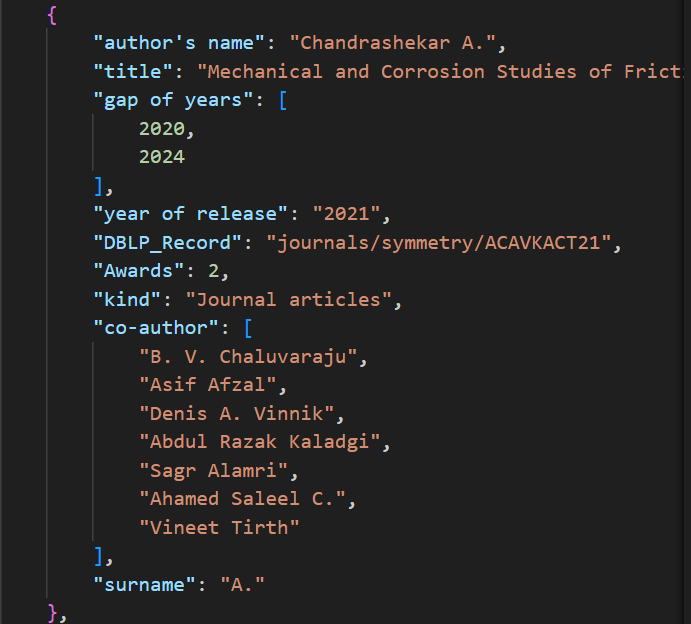


### Code for Change Data

```python
#!/usr/bin/env python 
import json
import random

# Path to your JSON file
filename = '../pol.json'

try:
    # Read JSON data
    with open(filename, 'r') as file:
        data = json.load(file)
    
    # Iterate through each record
    for record in data:
        # Check if 'gap of years' exists and is a string (unconverted)
        if 'gap of years' in record and isinstance(record['gap of years'], str):
            # Split, strip, and convert to integers
            start_year, end_year = map(lambda x: int(x.strip()), record['gap of years'].split('-'))
            # Replace the string with a tuple
            record['gap of years'] = (start_year, end_year)
        
        # Check if "author's name" exists and is a string, then add or update the surname
        if "author's name" in record and isinstance(record["author's name"], str):
            surname = record["author's name"].strip().split(' ')[-1].strip()
            # Add or update the 'surname' field in the record
            record['surname'] = surname
        
        # Check if "year of release" is a string (unconverted)
        if "year of release" in record and isinstance(record["year of release"], str):
            # Convert to integer
            record["year of release"] = int(record["year of release"])
        
        # Check if "award" is a string (unconverted)
        if "Awards" in record and isinstance(record["Awards"], str):
            #Generate random number for awards (0-2)
            #random_number = random.randint(0, 2)
            #record["Awards"] = random_number
            # Convert to integer
            record["Awards"] = int(record["Awards"])

    # Write modified data back to JSON
    with open(filename, 'w') as file:
        json.dump(data, file, indent=4)

    print(f"Updated data saved in {filename}")

except FileNotFoundError:
    print("File not found. Please check the file path.")
except json.JSONDecodeError:
    print("Invalid JSON file. Please check the file's structure.")
except Exception as e:
    print(f"An error occurred: {e}")

```
#### Results for Change Data

 - Τα αποτελέσματα του `change_data.py` εμφανίζονται στο αρχείο `poll.json` όπου είναι μετατροπές στα ήδη υπάρχονα δεδομένα ανάλογα με το τι αλλαγές επιθυμούμε να πραγματοποιήσουμε.

- Ένα απλό παράδειγμα όπου αλλάζει το Award του επιστήμονα από `None` σε ένα τυχαίο αριθμό μεταξύ 0-2:
   
   - Before:
    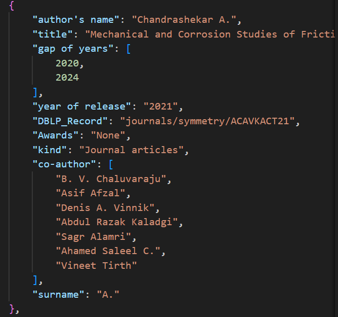   

   - After:
     


### Code for Get Hash Size

```python
#!/usr/bin/env python 
import json

# Path to your JSON file
filename = '../pol.json'

try:
    # Read JSON data
    with open(filename, 'r') as file:
        data = json.load(file)

    # list of all existing dblp records
    dblp_records = []

    # list of all existing surnames
    surnames = []

    # Iterate through each record
    for record in data:
        # Check if the record has a dblp key
        if 'DBLP_Record' in record:
            # Add the record to the list of dblp records
            dblp_records.append(record['DBLP_Record'])
        
        if 'surname' in record:
            surnames.append(record['surname'])

    # remove duplicates
    dblp_records = list(set(dblp_records))
    surnames = list(set(surnames))

    print(f"DBLP records: {len(dblp_records)}")
    print(f"Surnames: {len(surnames)} {surnames}")

    # open env file to write the hash
    with open('../.env', 'w') as file:
        file.write(f"DBLP_RECORDS_LENGTH={len(dblp_records)}\n")
        file.write(f"SURNAMES_LENGTH={len(surnames)}\n")

except FileNotFoundError:
    print("File not found. Please check the file path.")
except json.JSONDecodeError:
    print("Invalid JSON file. Please check the file's structure.")
except Exception as e:
    print(f"An error occurred: {e}")

```

#### Results for Get Hash Size

 - Τα αποτελέσματα του `get_hash_size.py` εμφανίζονται στο αρχείο `.env` όπου είναι το μήκος των μοναδικόν DBLP_Records και Surnames.
 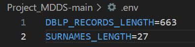

 # Interval Tree & Segment Tree

## Overview
Στο πιο κατω υποερωτημα ζητητε τη δημιουργία δομών δεδομένων για την αποθήκευση και την αναζήτηση χρονικών διαστημάτων 
δημοσιεύσεων επιστημόνων. Συγκεκριμενα ζητητε η δημιουργια ενως Interval tree και η δημιουργια ενως Segment tree.
Για την υλοποίηση των δομών δεδομένων αυτών χρησιμοποιήθηκε η γλώσσα προγραμματισμού Python. Στο παρακάτω κείμενο θα παρουσιαστεί ο κώδικας για την δημιουργία των δομών δεδομένων αυτών και ο τρόπος εκτέλεσης τους.

## Table of contents
[Interval Tree & Segment Tree](#interval-tree--segment-tree)
- [Overview](#overview)
- [Installation & Requirements](#installation--requirements)
- [Usage](#usage)
- [Basic Usage](#basic-usage)
- [code Documentation](#code-documentation)
  - [Modules](#modules)
  - [Fuctions](#fuctions)
    - [Interval Tree Code & Results](#interval-tree-code--results)
    - [Segment Tree Code & Results](#segment-tree-code--results)


## Installation & Requirements
Τα requirements για την εκτελσεση του κώδικα είναι τα εξής:
1.  - Για την εγκατάσταση της Python, ακολουθήστε τις οδηγίες που βρίσκονται στον παρακάτω σύνδεσμο: 
       [Python Installation](https://www.python.org/downloads/)
    - Εγκατάσταση του pip
    - Μετά την εγκατάσταση της Python, εγκαταστήστε το pip ακολουθώντας τις οδηγίες που βρίσκονται στον παρακάτω σύνδεσμο: 
      [Pip Installation](https://pip.pypa.io/en/stable/installation/)


## Usage
## Basic Usage
Για την εκτέλεση του κώδικα, ακολουθήστε τα παρακάτω βήματα:
 -Για το Interval Tree
    - Ανοίξτε το αρχείο interval_tree.py
    - Εκτελέστε τον κώδικα
 -Για το Segment Tree
    - Ανοίξτε το αρχείο segment_tree.py
    - Εκτελέστε τον κώδικα
    


## code Documentation
## Modules
- `test.py` : Περιέχει τον κώδικα για την δημιουργία του Interval Tree , στο φακελο intervalTree
- `test.py` : Περιέχει τον κώδικα για την δημιουργία του Segment Tree , στο φακελο segmentTree
## Fuctions 


 ## Interval Tree Code & Results
 Εδω αναλυουμε τον κώδικα για την δημιουργία του Interval Tree και τις συναρτησεις του :
 -κλαση Node : Περιέχει τα δεδομένα του κάθε κόμβου του δέντρου
 -κλαση IntervalTree : Περιέχει τις συναρτησεις για την δημιουργία του δέντρου και τις συναρτησεις για την αναζήτηση των δεδομένων
 -Συναρτηση main : Περιέχει τον κώδικα για την εκτέλεση του προγράμματος


  ```python
  import json

class Node:
    def __init__(self, data):
        self.data = data
        self.start = data['gap of years'][0]
        self.end = data['gap of years'][1]
        self.max_end = self.end
        self.left = None
        self.right = None

class IntervalTree:
    def __init__(self, records):
        self.root = None
        for record in records:
            self.insert(record)

    def insert(self, record, node=None):
        start, end = record['gap of years']
        if not node:
            node = self.root
        if not node:
            self.root = Node(record)
            return
        if start < node.start:
            if not node.left:
                node.left = Node(record)
            else:
                self.insert(record, node.left)
        else:
            if not node.right:
                node.right = Node(record)
            else:
                self.insert(record, node.right)
        node.max_end = max(node.max_end, end)

    def interval_query(self, start, end, node=None, results=None):
        if results is None:
            results = []
        if not node:
            node = self.root

        # Stop if we reach a leaf node
        if not node:
            return results

        # If the current node's interval intersects with the query interval, add it to results
        if start <= node.end and end >= node.start:
            results.append(node.data)

        # Traverse the left subtree if its intervals might intersect with the query interval
        if node.left and start <= node.left.max_end:
            self.interval_query(start, end, node.left, results)

        # Traverse the right subtree if its intervals might intersect with the query interval
        if node.right and end >= node.start:
            self.interval_query(start, end, node.right, results)

        return results

    def query(self, point, node=None, results=None):
        if results is None:
            results = []
        if not node:
            node = self.root
        if node:
            if point >= node.start and point <= node.end:
                # results.append((node.start, node.end))
                results.append(node.data)
            if node.left and point <= node.left.max_end:
                self.query(point, node.left, results)
            if node.right:
                self.query(point, node.right, results)
        return results

def main():
    filename = '../../pol.json'
    data= json.load(open(filename, 'r'))

    # Create Interval Tree
    interval_tree = IntervalTree(data)

    queries = [
        (1995, 1997),
        (1998, 2000),
        (2004, 2005),
        (2009, 2012),
        (2016, 2017),
        (2021, 2023),
    ]


    # Stabbing querying
    print('Stabbing querying:')
    for query in queries:
        print("Query:", query[0], end=" ")
        print("Result:", end=" ")
        authors = []
        for i in interval_tree.query(query[0]):
            #print(i['gap of years'], end=" ")
            if i['author\'s name'] not in authors:
                authors.append(i['author\'s name'])
                print(i['author\'s name'], end=" ")
        print()

    print()

    # Interval querying
    print('Interval querying:')
    for query in queries:
        print("Query:", query, end=" ")
        print("Result:", end=" ")
        authors = []
        for i in interval_tree.interval_query(query[0], query[1]):
            #print(i['gap of years'], end=" ")
            if i['author\'s name'] not in authors:
                authors.append(i['author\'s name'])
                print(i['author\'s name'], end=" ")
        print()

if __name__ == '__main__':
    try:
        main()
    except KeyboardInterrupt:
        pass
    except Exception as e:
        print(e)
        pass
```

### Results 

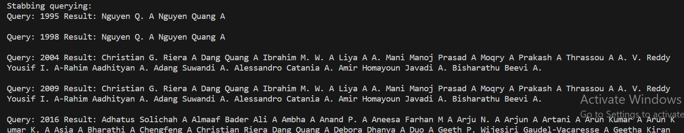

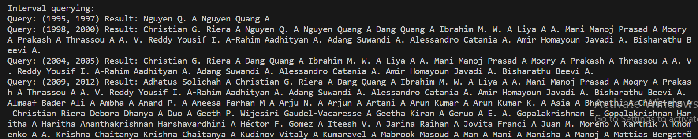


## Segment Tree Code & Results
Εδω αναλυουμε τον κώδικα για την δημιουργία του Segment Tree και τις συναρτησεις του :
-κλαση SegmentTreeNode : Περιέχει τα δεδομένα του κάθε κόμβου του δέντρου
-κλαση SegmentTree : Περιέχει τις συναρτησεις για την δημιουργία του δέντρου και τις συναρτησεις για την αναζήτηση των δεδομένων(διαχειρηση του δεντρου)
-Συναρτηση main : Περιέχει τον κώδικα για την εκτέλεση του προγράμματος


```python
import json

class SegmentTreeNode:
    def __init__(self, start, end):
        self.start = start
        self.end = end
        self.intervals = []
        self.left = None
        self.right = None

class SegmentTree:
    def __init__(self, intervals):
        # Determine the bounds of the tree
        all_points = [interval['gap of years'][0] for interval in intervals] + \
                     [interval['gap of years'][1] for interval in intervals]
        self.root = self.build_tree(min(all_points), max(all_points))
        for interval in intervals:
            self.insert(interval)

    def build_tree(self, start, end):
        if start > end:
            return None
        node = SegmentTreeNode(start, end)
        if start != end:
            mid = (start + end) // 2
            node.left = self.build_tree(start, mid)
            node.right = self.build_tree(mid + 1, end)
        return node

    def insert(self, interval):
        self._insert_node(self.root, interval)

    def _insert_node(self, node, interval):
        if not node:
            return
        start, end = interval['gap of years']
        if end < node.start or start > node.end:
            return
        if start <= node.start and end >= node.end:
            node.intervals.append(interval)
            return
        self._insert_node(node.left, interval)
        self._insert_node(node.right, interval)

    def query(self, point):
        return self._query_node(self.root, point, True)

    def interval_query(self, query_start, query_end):
        return self._query_node(self.root, query_start, False, query_end)

    def _query_node(self, node, point, is_query, end=None):
        if not node:
            return []
        if is_query:
            if point < node.start or point > node.end:
                return []
        else:
            if end < node.start or point > node.end:
                return []

        results = []
        added_intervals = set()  # Track unique intervals by their JSON representation

        def add_interval(interval):
            interval_json = json.dumps(interval, sort_keys=True)  # Convert interval to JSON string for uniqueness
            if interval_json not in added_intervals:
                results.append(interval)
                added_intervals.add(interval_json)

        for interval in node.intervals:
            if (is_query and interval['gap of years'][0] <= point <= interval['gap of years'][1]) or \
               (not is_query and interval['gap of years'][0] <= end and interval['gap of years'][1] >= point):
                add_interval(interval)

        for child_node in [node.left, node.right]:
            child_results = self._query_node(child_node, point, is_query, end)
            for interval in child_results:
                add_interval(interval)

        return results
    
def main():
    # Read data from JSON file
    filename = '../../pol.json'
    data = json.load(open(filename, 'r'))

    # Create Segment Tree
    st = SegmentTree(data)

    queries = [
        (1995, 1997),
        (1998, 2000),
        (2004, 2005),
        (2009, 2012),
        (2016, 2017),
        (2021, 2023),
    ]

    # Stabbing querying
    print('Stabbing querying:')
    for query in queries:
        print('Query:', query[0], end=' ')
        print('Result:', end=' ')
        authors = []
        for i in st.query(query[0]):
            #print(i['gap of years'], end=' ')
            if i['author\'s name'] not in authors:
                authors.append(i['author\'s name'])
                print(i['author\'s name'], end=" ")
        print()

    print()

    # Interval querying
    print('Interval querying:')
    for query in queries:
        print('Query:', query, end=' ')
        print('Result:', end=' ')
        authors = []
        for i in st.interval_query(*query):
            #print(i['gap of years'], end=' ')
            if i['author\'s name'] not in authors:
                authors.append(i['author\'s name'])
                print(i['author\'s name'], end=" ")
        print()

if __name__ == '__main__':
    try:
        main()
    except KeyboardInterrupt:
        pass
    except Exception as e:
        print(e)
        pass

```

### Results 

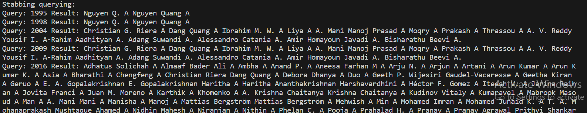

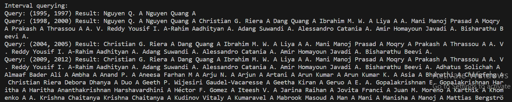


# 3D Convex Hull

## Overview
Το παρακάτο υποερωτημα του project αποτελεί την υλοποίηση του αλγορίθμου του 3D Convex Hull σε Rust. 

Πιο συγκεκριμένα, ο αλγόριθμος που υλοποιήθηκε είναι ο αλγόριθμος του QuickHull. Ο αλγόριθμος αυτός είναι ένας αλγόριθμος που χρησιμοποιείται για την εύρεση του Convex Hull ενός συνόλου σημείων στον τρισδιάστατο χώρο (στην περιπτοση μας). 

Ο αλγόριθμος αυτός εχει πολυπλοκοτητα Ο(nlogn) και στη χειρότερη περίπτωση έχει πολυπλοκοτητα O(n^2).

## Table of Contents
- [3D Convex Hull](#3d-convex-hull)
  - [Overview](#overview)
  - [Table of Contents](#table-of-contents)
  - [Installation & Requirements](#installation--requirements)
  - [Usage](#usage)
    - [Basic Usage](#basic-usage)
    - [Advanced Features](#advanced-features)
  - [Code Documentation](#code-documentation)
    - [Modules](#modules)
    - [Functions](#functions)
  - [Visualisation](#visualisation)
  - [Resulsts](#results)
    - [Results For Points](#results-for-points)
    - [Results For Edges](#results-for-edges)
    - [Results For Planes](#results-for-planes)

## Table of Contents

## Installation & Requirements
Τα requirements για την εκτελσεση του κώδικα είναι τα εξής:
- Εγκατάσταση της Rust
  - Για την εγκατάσταση της Rust, ακολουθήστε τις οδηγίες που βρίσκονται στον παρακάτω σύνδεσμο: [Rust Installation](https://www.rust-lang.org/tools/install)
- Εγκατάσταση της Python
  - Για την εγκατάσταση της Python, ακολουθήστε τις οδηγίες που βρίσκονται στον παρακάτω σύνδεσμο: [Python Installation](https://www.python.org/downloads/)
  - Εγκατάσταση του pip
    - Μετά την εγκατάσταση της Python, εγκαταστήστε το pip ακολουθώντας τις οδηγίες που βρίσκονται στον παρακάτω σύνδεσμο: [Pip Installation](https://pip.pypa.io/en/stable/installation/)
  - Εγκατάσταση του lib `matplotlib`
    - Μετά την εγκατάσταση του pip, εγκαταστήστε το lib `matplotlib` μέσω του pip με την εντολή: `pip install matplotlib`
  - Επισης, εγκαταστήστε το lib `mpl_toolkits` μέσω του pip

## Usage

### Basic Usage
Για την εκτέλεση του κώδικα, ακολουθήστε τα παρακάτω βήματα:
- Τρέξτε τα προγραματα που βρίσκονται στον φάκελο `Crawler` με ονομα `change_data.py` και `get_hash_size.py` (επεξιγηση τους στον καταληλο φακελο).
- Τωρα στον φακελο `QueryB/convex_hull` τρέξτε την εντολή `cargo run` για να τρέξετε τον κώδικα.

### Advanced Features
- Τέλος, τρέξτε τον κώδικα του `visualise.py` για να δείτε το αποτέλεσμα του Convex Hull σε γραφική μορφή.
```bash
╭─mauragkas@archlinuxlp ~/git/Project_MDDS/QueryB/convex_hull ‹main●› 
╰─λ ./visualise.py 
Usage: ./visualiser.py [points|edges|planes]
```
για το επιθημιτο οπτικο αποτελεσμα τρεξτε τον κωδικα με την εντολη `./visualise.py planes` ή `./visualise.py points`.

## Code Documentation

### Modules
- `convex_hull.rs`: Περιέχει τον κώδικα του αλγορίθμου του QuickHull καθως και την υλοποίηση του Convex Hull structure.
- `point.rs`: Περιέχει τον κώδικα για την υλοποίηση των σημείων στον τρισδιάστατο χώρο.
- `edge.rs`: Περιέχει τον κώδικα για την υλοποίηση των ακμών στον τρισδιάστατο χώρο.
- `plane.rs`: Περιέχει τον κώδικα για την υλοποίηση των επιπέδων στον τρισδιάστατο χώρο.
  - επιπλεον περιεχει μια method για τον υπολογισμο της normal ενος επιπεδου.
- `functions.rs`: Περιέχει τον κώδικα για την υλοποίηση των βασικών συναρτήσεων που χρησιμοποιούνται στον αλγόριθμο του QuickHull.
- `hush_stuff.rs`: Περιέχει τον κώδικα για την υλοποίηση των βασικών συναρτήσεων που χρησιμοποιούνται για την δημιουργια των points μεσω του hashing.


### Functions

εδω θα μηλισουμε για τις ποιο σημαντικες συναρτησεις του κωδικα. για τις υπολοιπες μπορειτε να δειτε τον κωδικα.(πιστευω οτι ειναι αρκετα απλες ή αυτοεξηγουμενες)

- `fn init_simplex(&mut self)` : Συνάρτηση που δημιουργεί το αρχικό simplex που θα χρησιμοποιηθεί για την κατασκευή του Convex Hull.
```rust
fn init_simplex(&mut self) {
  // get 4 non collinear points
  let mut points: Vec<Point> = Vec::new();
  match find_non_collinear_points(&self.points) {
      Some(p) => points = p,
      None => println!("No non collinear points found"),
  }
  // create the first 4 planes
  let plane1 = Plane::new(points[1].clone(), points[0].clone(), points[2].clone());
  let plane2 = Plane::new(points[0].clone(), points[1].clone(), points[3].clone());
  let plane3 = Plane::new(points[2].clone(), points[0].clone(), points[3].clone());
  let plane4 = Plane::new(points[1].clone(), points[2].clone(), points[3].clone());
  // add the planes to the planes vector
  self.planes.push(plane1);
  self.planes.push(plane2);
  self.planes.push(plane3);
  self.planes.push(plane4);
}
```
1. Εύρεση τεσσάρων μη γραμμικών σημείων από ένα δεδομένο σύνολο, διασφαλίζοντας ότι μπορούν να σχηματίσουν ένα έγκυρο τετράεδρο.

2. Δημιουργία τεσσάρων επιπέδων, καθένα από τα οποία αντιπροσωπεύει μια όψη του τετραέδρου.

3. Push τα επίπεδα σε ένα Vec που είναι μέρος της δομής του simplex, κατασκευάζοντας αποτελεσματικά τη γεωμετρία του simplex.

- `pub fn quick_hull(&mut self)` : Συνάρτηση που υλοποιεί τον αλγόριθμο του QuickHull.
```rust
pub fn quick_hull(&mut self) {
        self.init_simplex();

        let mut hull: Vec<Plane> = Vec::new();

        let mut i = 0;

        loop {
            if self.planes.is_empty() {
                break;
            } 
            let plane = self.planes.pop().unwrap();
            let mut os: Vec<Point> = Vec::new();
            for point in self.points.iter() {
                if point_above_plane(&plane, &point) {
                    os.push(point.clone());
                }
            }

            // find the farthest point from the plane
            let farthest_point = match farthest_point_from_plane(&plane, &os) {
                Some(p) => p,
                None => {
                    i += 1;
                    hull.push(plane.clone());
                    continue;
                }
            };

            // find the planes that the farthest point is above of
            let mut planes_under_it: Vec<Plane> = Vec::new();
            planes_under_it.push(plane.clone());
            for plane in self.planes.iter() {
                if point_above_plane(&plane, &farthest_point) {
                    planes_under_it.push(plane.clone());
                }
            }

            // get the planes edges
            let mut edges: Vec<Edge> = Vec::new();
            for plane in planes_under_it.iter() {
                edges.append(&mut plane.get_edges());
            }

            // remove the edges that are shared by two planes
            let mut unique_edges: Vec<Edge> = Vec::new();
            for edge in edges.iter() {
                if !unique_edges.contains(edge) {
                    unique_edges.push(edge.clone());
                } else {
                    unique_edges.remove(unique_edges.iter().position(|e| *e == *edge).unwrap());
                }
            }

            // get the points from the edges and create the planes
            let mut planes_to_add: Vec<Plane> = Vec::new();
            for edge in unique_edges.iter() {
                let a = edge.start.clone();
                let b = edge.end.clone();
                let c = farthest_point.clone();
                let plane = Plane::new(a, b, c);
                
                planes_to_add.push(plane);
            }

            // add the planes to the planes vector
            for plane in planes_to_add.iter() {
                self.planes.push(plane.clone());
            }

            for plane in planes_under_it.iter() {
                if self.planes.contains(plane) {
                    self.planes.remove(self.planes.iter().position(|p| *p == *plane).unwrap());
                }
            }

            i += 1;
        }

        println!("Iterations: {}", i);
        self.planes = hull;
        
    }
```

1. Αρχικοποίηση του Convex Hull με την κατασκευή του αρχικού simplex.

2. Επαναληπτική εφαρμογή του αλγορίθμου μέχρι να εξαντληθούν τα επίπεδα που αντιπροσωπεύουν το Convex Hull.

3. Εύρεση των σημείων που βρίσκονται πάνω από το επίπεδο.

4. Εύρεση του σημείου που βρίσκεται πιο μακριά από το επίπεδο.

5. Εύρεση των επιπέδων που το σημείο βρίσκεται πάνω από αυτά.

6. Εύρεση των ακμών που αντιπροσωπεύουν τα επίπεδα.

7. Κατασκευή νέων επιπέδων με βάση τις ακμές.

8. Αφαίρεση των παλιών επιπέδων και προσθήκη των νέων.

9. Επανάληψη των παραπάνω βημάτων μέχρι να εξαντληθούν τα επίπεδα.

- `functions.rs`: Περιέχει τον κώδικα για την υλοποίηση των βασικών συναρτήσεων που χρησιμοποιούνται στον αλγόριθμο του QuickHull.
  - ` create_rng_ponts(it: u32)` : Συνάρτηση που δημιουργεί τυχαία σημεία στον τρισδιάστατο χώρο. (Χρησιμοποιείται για το testing του αλγορίθμου)
  - `populate_point_vec()` : Συνάρτηση που περνει τα data απο το json και τα μετατρεπει σε σημεια.
  - `cross_product(a: &Point, b: &Point)` : Συνάρτηση που υπολογίζει τον cross product.
  - `dot_product(a: &Point, b: &Point)` : Συνάρτηση που υπολογίζει τον dot product.
  - `magnitude(vector: &Point)` : Συνάρτηση που υπολογίζει το μέτρο ενός διανύσματος.
  - `point_to_plane_distance(plane: &Plane, point: &Point)` : Βοηθητική συνάρτηση που υπολογίζει την απόσταση ενός σημείου από ένα επίπεδο.
  - `farthest_point_from_plane(plane: &Plane, points: &[Point])` : Συνάρτηση που υπολογίζει το σημείο που είναι το πιο μακριά από ένα επίπεδο.
  - `point_above_plane(plane: &Plane, point: &Point)` : Συνάρτηση που ελέγχει αν ένα σημείο είναι πάνω από ένα επίπεδο return true αν είναι αλλιώς false βαση του dot product.
  - `find_non_collinear_points(points: &Vec<Point>)` : Συνάρτηση που βρίσκει τα σημεία που δεν είναι κολινεαρικά για την κατασκευη του initial simplex. (περιεχει βοηθητικες συναρτησεις)
  - τελος περιεχει τις συναρτηση `save_to_json<T>(filename: &str, data: &T)` που αποθηκευει γενικα δεδομενα σε json σε ενα δοσμενο filename.

- `hash_stuff.rs` :
  - **Διαχείριση περιβαλλοντικών μεταβλητών**: Χρησιμοποιεί ένα συνδυασμό μιας προσαρμοσμένης δομής `Env` και της μακροεντολής `lazy_static!` για να φορτώσει και να αναλύσει τις μεταβλητές περιβάλλοντος από ένα αρχείο μία φορά κατά την εκτέλεση, παρέχοντας έναν αποτελεσματικό και επαναχρησιμοποιήσιμο μηχανισμό για πρόσβαση σε αυτές τις ρυθμίσεις σε όλη την εφαρμογή.
  
  - **Χειρισμός δεδομένων με σειριοποίηση**: Υλοποιεί μια δομή `Data` για την αναπαράσταση δομημένων δεδομένων, αξιοποιώντας τη βιβλιοθήκη `serde` για εύκολη σειριοποίηση και αποσειριοποίηση. Αυτό επιτρέπει τον ευέλικτο χειρισμό δεδομένων με προσαρμοσμένα ονόματα πεδίων για να ταιριάζουν με εξωτερικές μορφές δεδομένων (π.χ. JSON).
  
  - **Συνάρτηση χρησιμότητας για το Hashing**: Προσφέρει μια απλή συνάρτηση κατακερματισμού συμβολοσειρών.
  
## Visualisation

Αυτό το Python script είναι σχεδιασμένο για την οπτικοποίηση γεωμετρικών δεδομένων 3D, ειδικότερα σημείων, ακμών και επιπέδων. Είναι ιδιαίτερα χρήσιμο για εφαρμογές όπως η απεικόνιση των κορυφών, των ακμών και των όψεων ενός κυρτού περιβλήματος. Το script υποστηρίζει τρεις λειτουργίες: σημεία, ακμές και επίπεδα, κάθε μία προσφέρει μια μοναδική προοπτική στα δεδομένα.

## Requirements

- Python 3.x
- matplotlib
- mpl_toolkits.mplot3d

Βεβαιωθείτε ότι έχετε εγκαταστήσει την Python 3 και την matplotlib στο περιβάλλον σας. Η matplotlib μπορεί να εγκατασταθεί με την εντολή pip:

```sh
pip install matplotlib
```

## Data Structure

Το script αναμένει ένα αρχείο JSON με όνομα `convex_hull.json` που περιέχει τα γεωμετρικά δεδομένα δομημένα ως εξής:

- **Σημεία**: Μια λίστα από λεξικά, καθένα αντιπροσωπεύοντας ένα σημείο με συντεταγμένες `x`, `y`, και `z`.
- **Ακμές**: (Για τη λειτουργία ακμών) Μια λίστα από λεξικά που αντιπροσωπεύουν τις ακμές, με κάθε ακμή ορισμένη από δύο σημεία (`start` και `end`).
- **Επίπεδα**: (Για τη λειτουργία επιπέδων) Μια λίστα από λεξικά, κάθε ένα αντιπροσωπεύοντας ένα επίπεδο ορισμένο από τρία σημεία και ένα κανονικό διάνυσμα.

Παράδειγμα δομής JSON: (αυτα που μας αφορουν ειναι τα σημεια, τα επιπεδα και οι ακμες)

```json
{
  "points": [{"x": 1, "y": 2, "z": 3}, ...],
  "edges": [{"start": {"x": 1, "y": 2, "z": 3}, "end": {"x": 4, "y": 5, "z": 6}}, ...],
  "planes": [{"point_a": {"x": 1, "y": 2, "z": 3}, "point_b": {"x": 4, "y": 5, "z": 6}, "point_c": {"x": 7, "y": 8, "z": 9}, "normal": {"x": 0, "y": 0, "z": 1}}, ...]
}
```

## Usage

Το script εκτελείται από τη γραμμή εντολών με ένα από τρία επιχειρήματα για να καθορίσει τη λειτουργία οπτικοποίησης:

```sh
./visualiser.py [points|edges|planes]
```

Για παράδειγμα, για να οπτικοποιήσετε σημεία:

```sh
./visualiser.py points
```

### 

- **Σημεία**: Οπτικοποιεί όλα τα σημεία στον 3D χώρο.
- **Ακμές**: Οπτικοποιεί όλες τις ακμές που συνδέουν σημεία.
- **Επίπεδα**: Οπτικοποιεί επίπεδα ορισμένα από σύνολα τριών σημείων, συμπεριλαμβανομένων των κανονικών διανυσμάτων.


## Functions

- **get_the_data_from_file(filename)**: Διαβάζει και αναλύει τα δεδομένα JSON από το καθορισμένο αρχείο.
- **plot_points(data)**: Οπτικοποιεί τα σημεία στον 3D χώρο.
- **plot_edges(data)**: Οπτικοποιεί τις ακμές που συνδέουν σημεία.
- **plot_planes(data)**: Οπτικοποιεί τα επίπεδα, συμπεριλαμβανομένων των κανονικών διανυσμάτων.


## Results

### Results for Edges

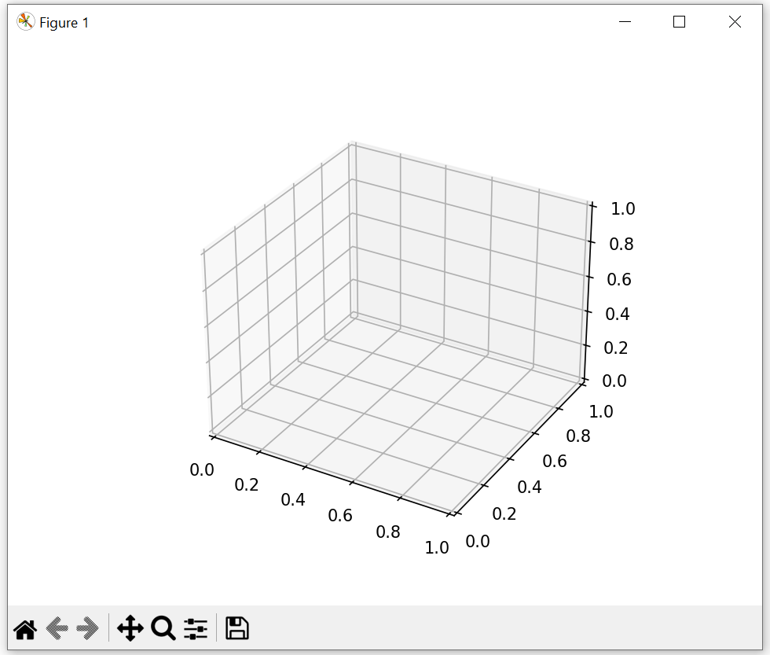

### Results for Points

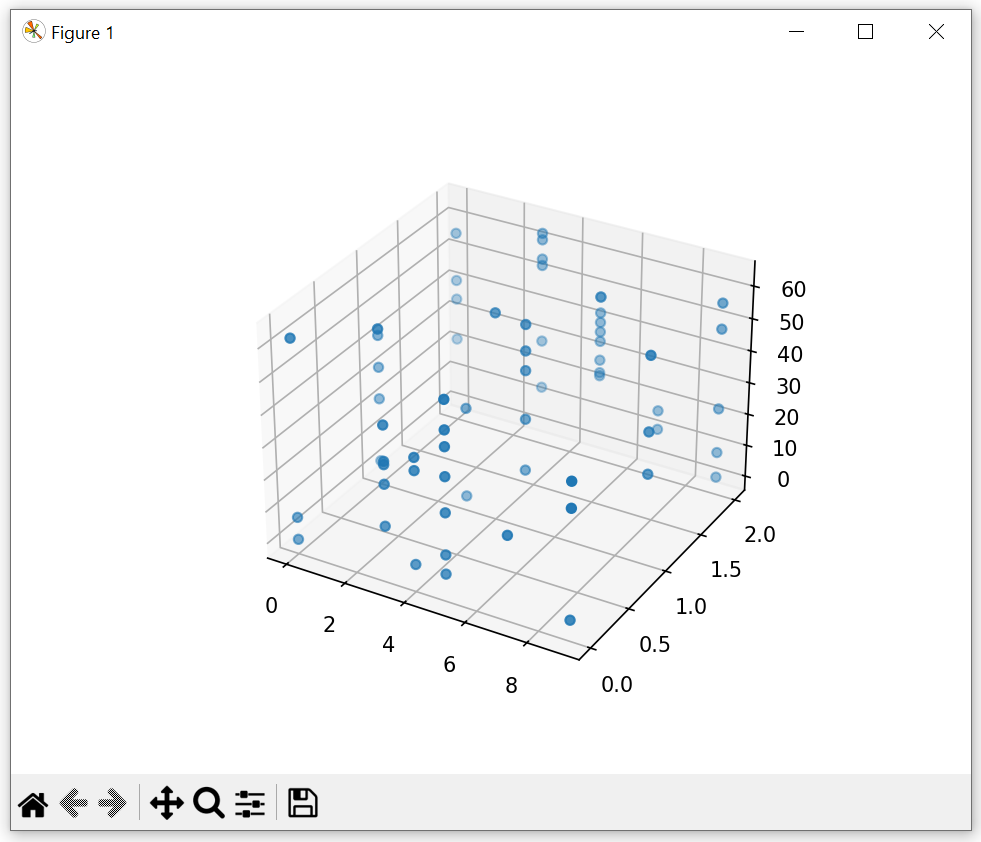

### Results for Planes

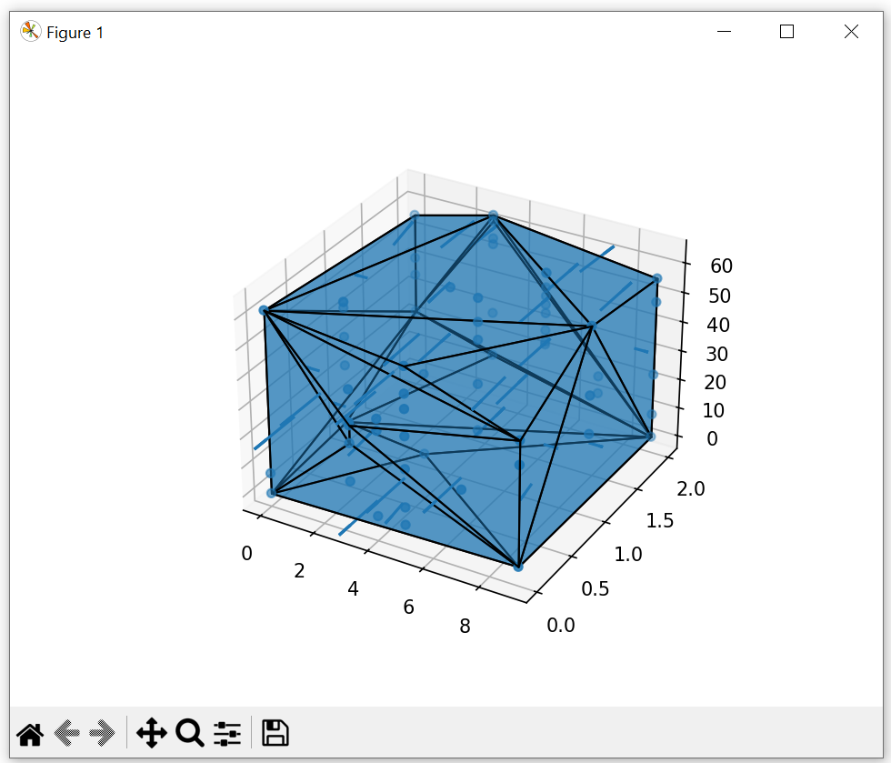


# Skyline Operator & Convex Hull

## Overview
Το παρακάτο υποερωτημα του project αποτελεί την υλοποίηση του αλγορίθμου του `2D Convex Hull` και του `2D Skyline Operator` σε Python. 

Πιο συγκεκριμένα, ο αλγόριθμος που υλοποιήθηκε είναι ο αλγόριθμος του `Graham Scan`. Ο αλγόριθμος αυτός είναι ένας αλγόριθμος που χρησιμοποιείται για την εύρεση του `Convex Hull` ενός συνόλου σημείων στον δυσδιάστατο χώρο (στην περίπτωση μας). 

Ο αλγόριθμος `Skyline Operator` 2D επιστρέφει το σύνολο των σημείων που αποτελούν το Skyline, δηλαδή τα σημεία που δεν μπορούν να κυριαρχηθούν από άλλα σημεία σε κάποιο άλλο κριτήριο. Στην περίπτωση μας υπολογίζουμε τα 4 υποσύνολα: `1o Subset` μικρότερες τιμές για d1 και d2, `2o Subset` μια μικρότερη τιμή d1 και μια μεγαλύτερη τιμή d2, `3o Subset` μια μεγαλύτερη τιμή d1 και μια μικρότερη τιμή d2, `4o Subset` μεγαλύτερες τιμές σε όλες τις διαστάσεις.

## Table of Contents
[Skyline Operator & Convex hull](#skyline-operator--convex-hull)
  - [Overview](#overview)
  - [Table of Contents](#table-of-contents)
  - [Installation & Requirements](#installation--requirements)
  - [Usage](#usage)
  - [Code Documentation](#code-documentation)
    - [Functions](#functions)
    - [Code](#code)
      - [Results](#results) 

## Table of Contents

## Installation & Requirements
Τα requirements για την εκτελσεση του κώδικα είναι τα εξής:
- Εγκατάσταση της Python
  - Για την εγκατάσταση της Python, ακολουθήστε τις οδηγίες που βρίσκονται στον παρακάτω σύνδεσμο: [Python Installation](https://www.python.org/downloads/)
  - Εγκατάσταση του pip
    - Μετά την εγκατάσταση της Python, εγκαταστήστε το pip ακολουθώντας τις οδηγίες που βρίσκονται στον παρακάτω σύνδεσμο: [Pip Installation](https://pip.pypa.io/en/stable/installation/)
  - Εγκατάσταση του lib `matplotlib`
    - Μετά την εγκατάσταση του pip, εγκαταστήστε το lib `matplotlib` μέσω του pip με την εντολή: `pip install matplotlib`
  -  Εγκατάσταση του lib `NumPy`
    - Μετά την εγκατάσταση του pip, εγκαταστήστε το lib `NumPy` μέσω του pip με την εντολή: `pip install numpy`

## Usage

Για την εκτέλεση του κώδικα ακολουθήστε τα παρακάτω βήματα:
- Για το αρχείο test.py τρεξτε τον κώδικα με την εντολή `./test.py`

## Code Documentation

### Functions
- `def convex_hull(points):`: Περιέχει τον κώδικα του αλγορίθμου του `Graham Sca`n καθως και την υλοποίηση του `Convex Hull` structure ενος συνόλου 2D σημείων.
- `def orientation(p, q, r):`: Συγκρίνει 3 σημεία και βρίσκει τον προσανατολισμό τους. Επιστρέφει 0 αν είναι κολινέα, 1 αν είναι δεξιόστροφος και 2 αν είναι αριστερόστροφος.
  - Βοηθητική συνάρτηση για την εύρεση του `Convex Hull`.
- `def skyline`: Περιέχει τον κώδικα για την υλοποίηση των skyline σημείων στον δυσδιάστατο χώρο. 
- `def is_dominated`: Είναι βοηθιτική συνάρτηση για την υλοποίηση του `Skyline Operator`. Περιέχει τον κώδικα για την εύρεση των σημείων που δεν κυριαρχούνται από όλα τα υπόλοιοπα. Ανάλογα με το case που επιλέγουμε βρίσκει τα σημεία για:
  - `1o subset:` MIN d1, MIN d2
  - `2o subset:` MIN d1, MAX d2
  - `3o subset`: MAX d1, MIN d2
  - `4o subset`: MAX d1, MAX d2  
- `hash_function(string):`: Περιέχει τον κώδικα για την μετατροπή του DBLP_Records το οποίο είναι σε μορφή string σε μορφή integer μεσω του hashing.


### Code

```python
#!/usr/bin/env python
import matplotlib.pyplot as plt
import numpy as np
import json


with open('../.env', 'r') as file:
    # Read the environment file line by line
    for line in file:
        # Split the line by '='
        key, value = line.split('=')
        # Remove newline character from value
        value = value.strip()
        # Set the environment variable
        globals()[key] = int(value)

def hash_function(string):
    """Simple hash function to convert a string to a number."""
    return sum([ord(c) for c in string]) % DBLP_RECORDS_LENGTH

def orientation(p, q, r):
    """Calculate orientation of ordered triplet (p, q, r). 
    Returns 0 if collinear, 1 if clockwise, 2 if counterclockwise."""
    val = (q[1] - p[1]) * (r[0] - q[0]) - (q[0] - p[0]) * (r[1] - q[1])
    if val == 0: return 0  # Collinear
    return 1 if val > 0 else 2  # Clock or counterclockwise

def convex_hull(points):
    """Perform Graham Scan to find the convex hull of a set of 2D points."""
    n = len(points)
    if n < 3: return  # Convex hull not possible with less than 3 points

    # Find the bottom-most point (or choose the left most point in case of tie)
    points = sorted(points, key=lambda p: (p[1], p[0]))

    # Sort the remaining points based on their angle with the first point
    sorted_pts = sorted(points[1:], key=lambda p: np.arctan2(p[1] - points[0][1], p[0] - points[0][0]))

    # Place the bottom-most point back in the sorted list
    sorted_pts.insert(0, points[0])

    # Create an empty stack and push first three points
    hull = sorted_pts[:3]

    # Process remaining points
    for p in sorted_pts[3:]:
        while len(hull) > 1 and orientation(hull[-2], hull[-1], p) != 2:
            hull.pop()
        hull.append(p)

    return np.array(hull)

def is_dominated(point, others, dominance_case):
    for other in others:
        if not (point[0] == other[0] and point[1] == other[1]):  # Compare elements individually
            # Case 1: MIN d1, MIN d2 (lower-left dominance)
            if dominance_case == 1 and other[0] <= point[0] and other[1] <= point[1]:
                return True
            # Case 2: MIN d1, MAX d2 (upper-left dominance)
            elif dominance_case == 2 and other[0] <= point[0] and other[1] >= point[1]:
                return True
            # Case 3: MAX d1, MIN d2 (lower-right dominance)
            elif dominance_case == 3 and other[0] >= point[0] and other[1] <= point[1]:
                return True
            # Case 4: MAX d1, MAX d2 (upper-right dominance)
            elif dominance_case == 4 and other[0] >= point[0] and other[1] >= point[1]:
                return True
    return False

def skyline(points, dominance_case=1):
    """Find all points in the skyline."""
    skyline_points = []
    for point in points:
        # if not is_dominated(point, points):
        if not is_dominated(point, points, dominance_case):
            skyline_points.append(point)
    return np.array(skyline_points)

def main():
    # Path to your JSON file
    filename = '../pol.json'
    data= json.load(open(filename, 'r'))
    
    points=[]
    # Iterate through each record
    i=0
    for record in data:
        # Get year of release of each record
        if 'Awards' in record:
            awrd = record['Awards']
            print("Awards:", awrd)
        # Convert DBLP_Record (str) to a hash
        if 'DBLP_Record' in record:
            DBLP_Record_Hash = hash_function(record['DBLP_Record'])
            print(" DBLP_Record:", record['DBLP_Record'], "  DBLP_Record_Hash:", DBLP_Record_Hash)
        points.append((awrd, DBLP_Record_Hash))
        print("Points: ", points[i])
        print()
        i+=1
    
    # Convert the list to a NumPy array
    points = np.array(points)
    hull_points = convex_hull(points)
    skyline_points = skyline(points, dominance_case=1)
    sorted_skyline_points = skyline_points[np.argsort(skyline_points[:, 0])]

    # First Plot - Points and Convex Hull
    plt.figure()
    plt.scatter(points[:,0], points[:,1], label='Points')
    for i in range(len(hull_points)):
        plt.plot([hull_points[i][0], hull_points[(i+1) % len(hull_points)][0]], 
                 [hull_points[i][1], hull_points[(i+1) % len(hull_points)][1]], 'r')
    plt.legend()

    # Second Plot - All Points with Skyline Highlighted
    plt.figure()
    plt.scatter(points[:,0], points[:,1], label='Points')
    plt.scatter(skyline_points[:,0], skyline_points[:,1], color='green', label='Skyline Points')
    for i in range(len(sorted_skyline_points) - 1):
        plt.plot([sorted_skyline_points[i][0], sorted_skyline_points[i+1][0]], 
                 [sorted_skyline_points[i][1], sorted_skyline_points[i+1][1]], 'g--')
    plt.legend()
    plt.show()

if __name__ == '__main__':
    try:
        main()
    except KeyboardInterrupt:
        pass
    except Exception as e:
        print(e)
        pass
```

#### Results 

- `Graphs` για `Convex Hull` και `Skyline Operator`:

  - Αποτελέσματα για δεδομένα περίπου 700 επιστημόνων.

    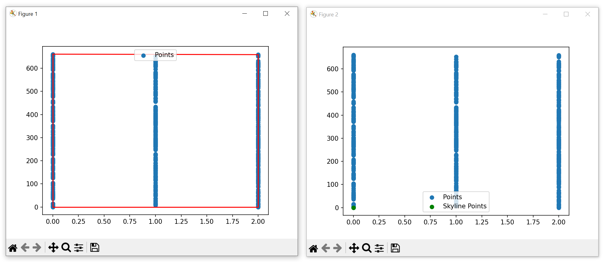

  - Αποτελέσματα για δεδομένα λιγότερων επιστημόνων όπου φαίνονται καλύτερα.

    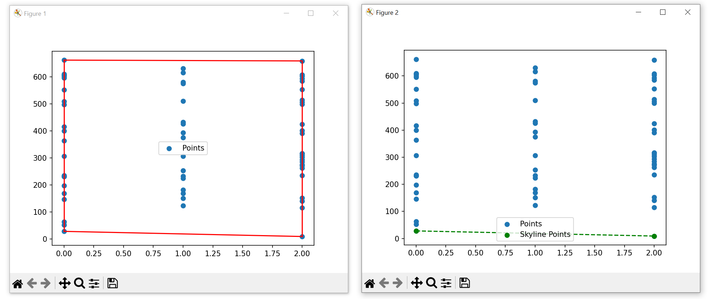


# Skyline Layers & Convex Hull

## Overview
Το παρακάτο υποερωτημα του project αποτελεί την υλοποίηση του αλγορίθμου του 2D `Convex Hull` και του `2D Skyline Layers` σε Python.

Πιο συγκεκριμένα, ο αλγόριθμος που υλοποιήθηκε είναι ο αλγόριθμος του 1Graham Scan1. Ο αλγόριθμος αυτός είναι ένας αλγόριθμος που χρησιμοποιείται για την εύρεση του `Convex Hull` ενός συνόλου σημείων στον δυσδιάστατο χώρο (στην περίπτωση μας). 

Ο αλγόριθμος `Skyline Layers` 2D όπως τον αλγόριθμο `Skyline Operator`, επιστρέφει το σύνολο των σημείων που αποτελούν το Skyline για όσα όμως layers καθορίσει ο χρήστης. Δηλαδή τα σημεία που δεν μπορούν να κυριαρχηθούν από άλλα σημεία σε κάποιον άλλο κριτήριο για το 1ο layer και επαναλαμβάνουμε την διαδικασία χωρίς τα σημεία που έχουμε βρεί στα προηγούμενα layers μέχρι να φτάσουμε στο επιθυμητό layer. Στην περίπτωση μας υπολογίζουμε τα 4 υποσύνολα: `1o Subset` μικρότερες τιμές για d1 και d2, `2o Subset` μια μικρότερη τιμή d1 και μια μεγαλύτερη τιμή d2, `3o Subset` μια μεγαλύτερη τιμή d1 και μια μικρότερη τιμή d2, `4o Subset` μεγαλύτερες τιμές σε όλες τις διαστάσεις.

## Table of Contents
 [Skyline Layers & Convex hull](#skyline-layers--convex-hull)
  - [Overview](#overview)
  - [Table of Contents](#table-of-contents)
  - [Installation & Requirements](#installation--requirements)
  - [Usage](#usage)
  - [Code Documentation](#code-documentation)
    - [Functions](#functions)
    - [Code](#code)
      - [Results D](#results-D)

## Table of Contents

## Installation & Requirements
Τα requirements για την εκτελσεση του κώδικα είναι τα εξής:
- Εγκατάσταση της Python
  - Για την εγκατάσταση της Python, ακολουθήστε τις οδηγίες που βρίσκονται στον παρακάτω σύνδεσμο: [Python Installation](https://www.python.org/downloads/)
  - Εγκατάσταση του pip
    - Μετά την εγκατάσταση της Python, εγκαταστήστε το pip ακολουθώντας τις οδηγίες που βρίσκονται στον παρακάτω σύνδεσμο: [Pip Installation](https://pip.pypa.io/en/stable/installation/)
  - Εγκατάσταση του lib `matplotlib`
    - Μετά την εγκατάσταση του pip, εγκαταστήστε το lib `matplotlib` μέσω του pip με την εντολή: `pip install matplotlib`
  -  Εγκατάσταση του lib `NumPy`
    - Μετά την εγκατάσταση του pip, εγκαταστήστε το lib `NumPy` μέσω του pip με την εντολή: `pip install numpy`

## Usage

Για την εκτέλεση του κώδικα ακολουθήστε τα παρακάτω βήματα:
- Για το αρχείο test.py τρεξτε τον κώδικα με την εντολή `./test.py`

## Code Documentation

### Functions
- `def convex_hull(points):`: Περιέχει τον κώδικα του αλγορίθμου του `Graham Sca`n καθως και την υλοποίηση του `Convex Hull` structure ενος συνόλου 2D σημείων.
- `def orientation(p, q, r):`: Συγκρίνει 3 σημεία και βρίσκει τον προσανατολισμό τους. Επιστρέφει 0 αν είναι κολινέα, 1 αν είναι δεξιόστροφος και 2 αν είναι αριστερόστροφος.
  - Βοηθητική συνάρτηση για την εύρεση του `Convex Hull`.
- `def find_skyline_layers`: Περιέχει τον κώδικα για την υλοποίηση των `skyline layers` στον δυσδιάστατο χώρο μέχρι και το τελευταίο layer που έχει καθοριστεί απο τον χρήστη. 
- `def is_dominated`: Περιέχει τον κώδικα για την εύρεση των σημείων που δεν κυριαρχούνται από όλα τα υπόλοιοπα. Ανάλογα με το case που επιλέγουμε βρίσκει τα σημεία για:
  - `1o subset:` MIN d1, MIN d2
  - `2o subset:` MIN d1, MAX d2
  - `3o subset`: MAX d1, MIN d2
  - `4o subset`: MAX d1, MAX d2  
  - Είναι βοηθητική συνάρτηση της συνάρτησης `def modified_skyline(points, dominance_case)`.
- `def modified_skyline(points, dominance_case)`: Περιέχει τον κώδικα όπου ξεχωρίζουμε σε διαφορετικές λίστες τα σημεία που αποτελούν το skyline μέχρι το τελευταίο layer που εχει εκτελεστεί και υπόλοιπα σημεία έτσι ώστε εαν πρέπει να συνεχίσουμε την αναζήτηση των skylines σε μεγαλύτερο layer να επαναλάβουμε την διαδικασία χωρίς τα σημεία που έχουμε ήδη βρεί και αποθηκεύσαμε στην λίστα `skyline_points = []`.
  - Είναι βοηθητική συνάρτηση που καλείται μέσω της συνάρτησης find_skyline_layers για να βρεί τα skyline σημεία ενός layer.
- `hash_function(string):`: Περιέχει τον κώδικα για την μετατροπή του DBLP_Records το οποίο είναι σε μορφή string σε μορφή integer μεσω του hashing.


### Code

```python
#!/usr/bin/env python
import matplotlib.pyplot as plt
import numpy as np
import json

with open('../.env', 'r') as file:
    # Read the environment file line by line
    for line in file:
        # Split the line by '='
        key, value = line.split('=')
        # Remove newline character from value
        value = value.strip()
        # Set the environment variable
        globals()[key] = int(value)

def hash_function(string):
    """Simple hash function to convert a string to a number."""
    return sum([ord(c) for c in string]) % DBLP_RECORDS_LENGTH

def orientation(p, q, r):
    """Calculate orientation of ordered triplet (p, q, r). 
    Returns 0 if collinear, 1 if clockwise, 2 if counterclockwise."""
    val = (q[1] - p[1]) * (r[0] - q[0]) - (q[0] - p[0]) * (r[1] - q[1])
    if val == 0: return 0  # Collinear
    return 1 if val > 0 else 2  # Clock or counterclockwise

def convex_hull(points):
    """Perform Graham Scan to find the convex hull of a set of 2D points."""
    n = len(points)
    if n < 3: return  # Convex hull not possible with less than 3 points

    # Find the bottom-most point (or choose the left most point in case of tie)
    points = sorted(points, key=lambda p: (p[1], p[0]))

    # Sort the remaining points based on their angle with the first point
    sorted_pts = sorted(points[1:], key=lambda p: np.arctan2(p[1] - points[0][1], p[0] - points[0][0]))

    # Place the bottom-most point back in the sorted list
    sorted_pts.insert(0, points[0])

    # Create an empty stack and push first three points
    hull = sorted_pts[:3]

    # Process remaining points
    for p in sorted_pts[3:]:
        while len(hull) > 1 and orientation(hull[-2], hull[-1], p) != 2:
            hull.pop()
        hull.append(p)

    return np.array(hull)

def is_dominated(point, others, dominance_case):
    for other in others:
        if not (point[0] == other[0] and point[1] == other[1]):  # Compare elements individually
            # Case 1: MIN d1, MIN d2 (lower-left dominance)
            if dominance_case == 1 and other[0] <= point[0] and other[1] <= point[1]:
                return True
            # Case 2: MIN d1, MAX d2 (upper-left dominance)
            elif dominance_case == 2 and other[0] <= point[0] and other[1] >= point[1]:
                return True
            # Case 3: MAX d1, MIN d2 (lower-right dominance)
            elif dominance_case == 3 and other[0] >= point[0] and other[1] <= point[1]:
                return True
            # Case 4: MAX d1, MAX d2 (upper-right dominance)
            elif dominance_case == 4 and other[0] >= point[0] and other[1] >= point[1]:
                return True
    return False

def modified_skyline(points, dominance_case=1):
    """Find skyline points and return them along with non-skyline points."""
    skyline_points = []
    non_skyline_points = []
    for point in points:
        if not is_dominated(point, points, dominance_case):
            skyline_points.append(point)
        else:
            non_skyline_points.append(point)
    return np.array(skyline_points), np.array(non_skyline_points)

def find_skyline_layers(points, dominance_case=1, max_layers=None):
    """Find skyline layers up to a user-defined limit."""
    layers = []
    remaining_points = points
    layer_count = 0
    while len(remaining_points) > 0 and (max_layers is None or layer_count < max_layers):
        skyline, remaining_points = modified_skyline(remaining_points, dominance_case)
        if len(skyline) == 0:
            break
        layers.append(skyline)
        layer_count += 1
    return layers

def main():
    # Path to your JSON file
    filename = '../pol.json'
    data= json.load(open(filename, 'r'))
    
    points=[]
    # Iterate through each record
    i=0
    for record in data:
        # Get year of release of each record
        if 'Awards' in record:
            awrd = record['Awards']
            print("Awards:", awrd)
        # Convert DBLP_Record (str) to a hash
        if 'DBLP_Record' in record:
            DBLP_Record_Hash = hash_function(record['DBLP_Record'])
            print(" DBLP_Record:", record['DBLP_Record'], "  DBLP_Record_Hash:", DBLP_Record_Hash)
        points.append((awrd,DBLP_Record_Hash))
        print("Points: ", points[i])
        print()
        i+=1
    
    # Convert the list to a NumPy array
    points = np.array(points)

    hull_points = convex_hull(points)

    # First Plot - Points and Convex Hull
    plt.figure()
    plt.scatter(points[:,0], points[:,1], label='Points')
    for i in range(len(hull_points)):
        plt.plot([hull_points[i][0], hull_points[(i+1) % len(hull_points)][0]], 
                 [hull_points[i][1], hull_points[(i+1) % len(hull_points)][1]], 'r')
    plt.legend()

    # Second Plot - All Points with Skyline Layers Highlighted
    plt.figure()
    plt.scatter(points[:,0], points[:,1], label='Points')
    layers = find_skyline_layers(points, dominance_case=1, max_layers=3)  # Adjust 'max_layers' as needed

    for k, layer in enumerate(layers):
        # Sort the layer points by x-coordinate for meaningful connection with dashed lines
        sorted_layer = layer[np.argsort(layer[:, 0])]
        plt.scatter(sorted_layer[:,0], sorted_layer[:,1], label=f'Skyline L-{k+1}')
        # Connect points with dashed lines if there are more than one point in the layer
        if len(sorted_layer) > 1:
            plt.plot(sorted_layer[:,0], sorted_layer[:,1], 'k--')  # 'k--' for black dashed line

    plt.legend()
    plt.show()

if __name__ == '__main__':
    try:
        main()
    except KeyboardInterrupt:
        pass
    except Exception as e:
        print(e)
        pass
```

#### Results

- `Graphs` για `Convex Hull` και `Skyline Layers`:

  - Αποτελέσματα για δεδομένα περίπου 700 επιστημόνων.
  
    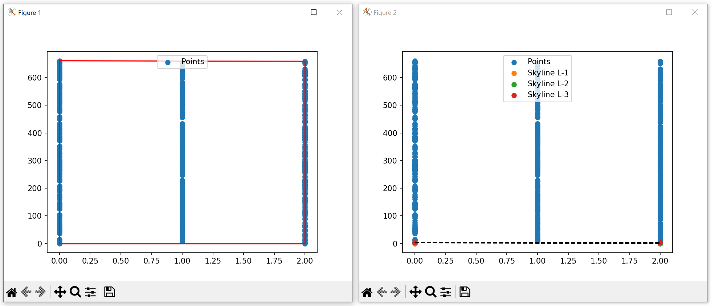


  - Αποτελέσματα για δεδομένα λιγότερων επιστημόνων όπου φαίνονται καλύτερα.

    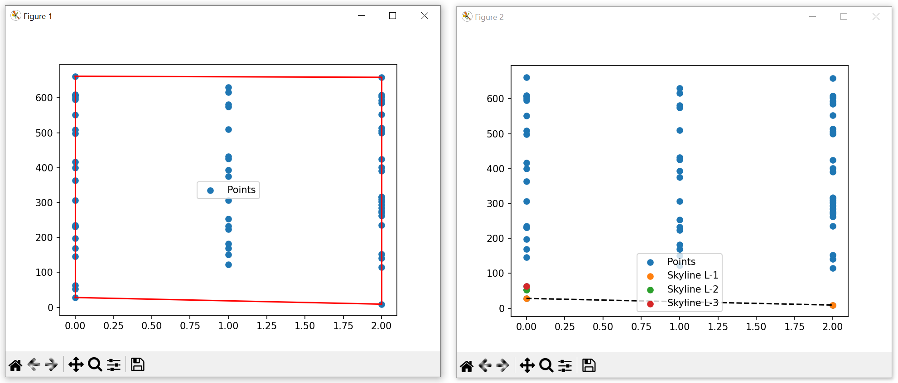
    

# Priority Search Tree για την Αναγνώριση Σημείων Skyline

Αυτός ο συνοπτικός οδηγός επικεντρώνεται σε ένα Python script που χρησιμοποιεί ένα Priority Search Tree (PST) για να αναγνωρίσει σημεία skyline από ένα σύνολο δεδομένων περιγραφόμενο σε ένα αρχείο JSON. Το script τονίζει τη χρήση του PST για αποδοτική διαχείριση χωρικών δεδομένων και υπολογισμό σημείων skyline.

## Introduction

Ένα Priority Search Tree (PST) είναι μια εξειδικευμένη δομή δεδομένων που επιτρέπει την αποδοτική ερώτηση χωρικών δεδομένων. Αυτό το script χρησιμοποιεί ένα PST για να επεξεργαστεί εγγραφές που περιέχουν τα πεδία 'Awards' και 'DBLP_Record', αναγνωρίζοντας σημεία που αποτελούν το "skyline", όπου κανένα σημείο δεν κυριαρχείται από άλλο σε και τις δύο διαστάσεις.

## Key Components

### Priority Search Tree (PST)

- **Λειτουργικότητα**: Το PST οργανώνει σημεία σε δύο διαστάσεις, επιτρέποντας την αποδοτική ερώτηση εύρους και την αναγνώριση σημείων skyline.
- **Κατασκευή**: Τα σημεία ταξινομούνται και τοποθετούνται αναδρομικά στο δέντρο βάσει των χωρικών τους χαρακτηριστικών.
- **Χρήση**: Το PST χρησιμοποιείται για να φιλτράρει και να αναγνωρίσει σημεία που δεν κυριαρχούνται από άλλα, καθορίζοντας το skyline.

### Data Processing

- **Είσοδος**: Ένα αρχείο JSON με εγγραφές, κάθε μία έχοντας τα πεδία 'Awards' και 'DBLP_Record'.
- **Hash Function**: Μετατρέπει το 'DBLP_Record' σ

ε μια αριθμητική τιμή hash, υπηρετώντας ως μία από τις χωρικές διαστάσεις.
- **Προετοιμασία**: Φιλτράρει τα κυριαρχημένα σημεία πριν από την κατασκευή του PST, εξασφαλίζοντας ότι το δέντρο περιέχει μόνο πιθανούς υποψηφίους για skyline.

### Skyline Identification

- **Αλγόριθμος**: Διασχίζει το PST για να βρει σημεία που δεν κυριαρχούνται από άλλα σε και τις δύο διαστάσεις, τον αριθμό των βραβείων και την τιμή hash του 'DBLP_Record'.
- **Κριτήρια Κυριαρχίας**: Ένα σημείο θεωρείται ότι κυριαρχεί άλλο αν είναι ανώτερο σε και τις δύο διαστάσεις.

### Visualization

- **Εργαλείο**: Χρησιμοποιεί τη βιβλιοθήκη Matplotlib για να διαγραμματίσει το σύνολο δεδομένων και να επισημάνει τα σημεία skyline, παρέχοντας μια οπτική ανάλυση των αποτελεσμάτων.

## Implementation Steps

1. **Ανάγνωση και Επεξεργασία Δεδομένων JSON**: Εξαγωγή και μετατροπή των 'Awards' και 'DBLP_Record' σε κατάλληλες αριθμητικές μορφές.
2. **Κατασκευή PST**: Δημιουργία του Priority Search Tree από τα επεξεργασμένα δεδομένα σημεία.
3. **Αναγνώριση Σημείων Skyline**: Χρήση του PST για την αποδοτική ανεύρεση και συγκέντρωση σημείων skyline.
4. **Οπτικοποίηση Αποτελεσμάτων**: Διαγράμμιση όλων των σημείων και διάκριση των σημείων skyline για εύκολη αναγνώριση.

## Requirements

- Python 3.x
- Βιβλιοθήκη Matplotlib

## Usage

Για να χρησιμοποιήσετε το script, βεβαιωθείτε ότι το αρχείο δεδομένων JSON είναι σωστά διαμορφωμένο με τα απαραίτητα πεδία. Ενημερώστε το script με τις σωστές διαδρομές αρχείων τόσο για τα δεδομένα όσο και για οποιεσδήποτε απαιτούμενες διαμορφώσεις περιβάλλοντος.

### Results

- `Graphs` για `Priority Search Tree` για την Αναγνώριση Σημείων `Skyline`:

  - Αποτελέσματα για δεδομένα περίπου 700 επιστημόνων.
  
    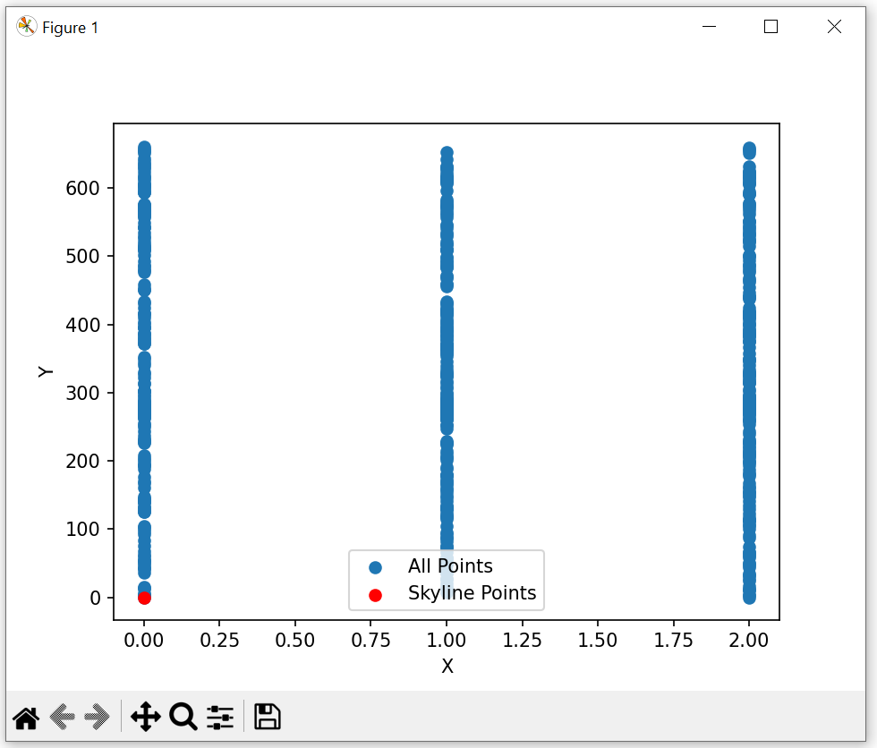
    
  - Αποτελέσματα για δεδομένα λιγότερων επιστημόνων όπου φαίνονται καλύτερα.

    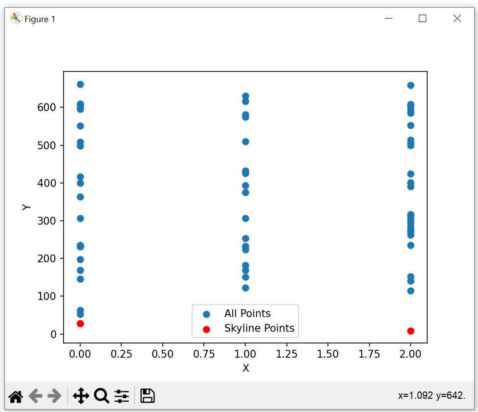